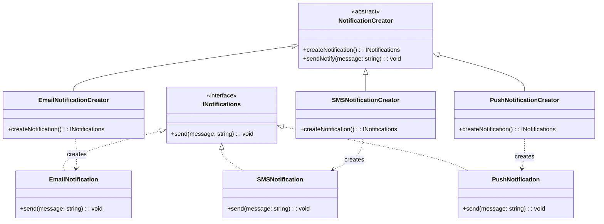

### OOP Concepts - Typescript

### Abstraction: 
- hiding unnecessary complexities and implementation details, exposing only essential features.
- Simplicity: hiding complex details
- Maintainability: changes dont affect application 
- Resusability: 
- Modularity: 
-Security: we are not exposing internal details/implementation of class
Real world exmple (RWE): TypeORM

### Encapsulation:
- bundling data and methods. Separation of concern and internal data hiding.
- Objects internal state is protected from direct manipulation from external code
- RWE: epoch time calculation in js Date object
- Data hiding: hiding implementaiton details and prevention of modification
- data integrity: prevent data modification

### Polymorphism:
- superclass having many forms. The same method name or interface exhibit different behaviors depending on the object that is invoking it.

### Design Patterns
#### Factory Pattern
- creational pattern that provides an interface for creating objects in superclass but allows subclasses to update the objects they created.

